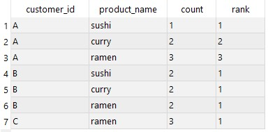
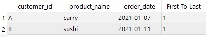
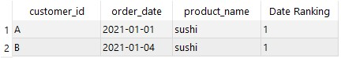
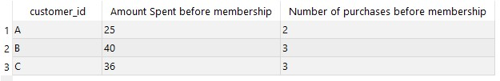
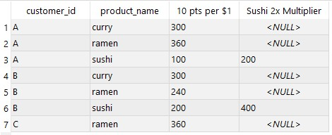
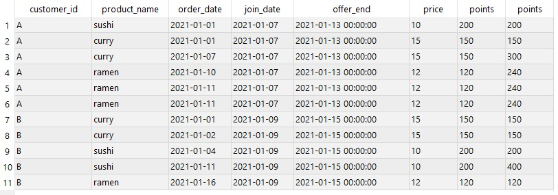
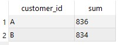

# Case Study #1: Danny's Diner🍝🍜
Danny's Diner is a Japanese-based restaurant. The restaurant was founded in 2021 with the goal of providing 3 main dishes namely  Sushi, Curry, and Ramen.

After a couple of months, a dataset was built which showcased the restaurant's growth and customer habits. In an effort to increase the business's growth and understand customer purchasing habits, an analysis of the existing dataset was requested.

## Problem Statement
The founder had a couple of questions concerning the business. Their aim was to get a good idea of customers purchasing patterns, best-sold products, etc. in order to help build a deeper relationship with customers and deliver a more personalized experience.

## Role
Data Analyst (SQL Developer)

## Tools Used
PostgreSQL, Valentina Studio

## Process
The project's dataset was downloaded from this [site](https://www.db-fiddle.com/f/2rM8RAnq7h5LLDTzZiRWcd/138)

### Pain Points
---
Here's a list of the case study questions that needed to be answered:
1. What is the total amount each customer spent at the restaurant?
2. How many days has each customer visited the restaurant?
3. What was the first item from the menu purchased by each customer?
4. What is the most purchased item on the menu and how many times was it purchased by all customers?
5. Which item was the most popular for each customer?
6. Which item was purchased first by the customer after they became a member?
7. Which item was purchased just before the customer became a member?
8. What are the total items and amount spent for each member before they became a member?
9. If each $1 spent equates to 10 points and sushi has a 2x points multiplier - how many points would each customer have?
10. In the first week after a customer joins the program (including their join date) they earn 2x points on all items, not just sushi - how many points do customers A and B have at the end of January?

<br>

### Walkthrough
---
A database was created in PostgreSQL (within Valentina Studio). Three tables were created within the database namely "members", "menu" and "sales". Each table contained a primary key/unique ID which allowed enabled us to build a STAR-SCHEMA model for the data analysis process.

###### _Dataset loaded into PostgreSQL_


---
### 1. What is the total amount each customer spent at the restaurant?

```SQL
SELECT customer_id, SUM(price)
FROM sales as s
    INNER JOIN menu as m ON s.product_id = m.product_id
GROUP BY customer_id
ORDER BY customer_id;
```

#### Result set:
| customer_id | total_sales |
| ----------- | ----------- |
| A           | 76          |
| B           | 74          |
| C           | 36          |

#### _Summary: Customers A, B, and C spent $76, $74 and $36 each._

<br>

---
### 2. How many days has each customer visited the restaurant?

```SQL
SELECT customer_id, COUNT(DISTINCT order_date) AS "Number of Days with Purchase"
FROM sales
GROUP BY customer_id
ORDER by customer_id;
```

#### Result set:
| customer_id | Number of Days with Purchase |
| ----------- | -----------------------------|
| A           | 4                            |
| B           | 6                            |
| C           | 2                            |

#### _Summary: Customer A visited the restaurant 4 times, Customer B visited the restaurant 6 times, Customer C visited the restaurant 2 times._

<br>

---
### 3. What was the first item from the menu purchased by each customer?

```SQL
WITH dataset as (
    SELECT customer_id, order_date, product_name, ROW_NUMBER() over(
        PARTITION BY customer_id
        ORDER BY order_date
        ) AS ranking
    FROM sales 
        INNER JOIN menu ON sales.product_id = menu.product_id
    ORDER BY customer_id
)
SELECT *
FROM dataset
WHERE ranking = 1;
```

#### Result set:
| customer_id | order_date | product_name | ranking  |
| ----------- | -----------| ------------ | -------- |
| A           | 4          | curry        | 1        |
| A           | 4          | sushi        | 1        |
| B           | 6          | curry        | 1        |
| C           | 2          | ramen        | 1        |
| C           | 2          | ramen        | 1        |


#### _Summary: Customer A's first purchase was Curry & Ramen, Customer B's first purchase was Curry, and Customer C's first purchase was Ramen._

<br>

---
### 4. What is the most purchased item on the menu and how many times was it purchased by all customers?

```SQL
SELECT sales.product_id, product_name, COUNT(sales.product_id)
FROM sales
    INNER JOIN menu ON sales.product_id = menu.product_id
GROUP BY sales.product_id, product_name
ORDER BY sales.product_id;
```

| product_id | product_name | count |
| ----------- | ----------- | ----- |
| 1           | sushi       | 3
| 2           | curry       | 4
| 3           | ramen       | 8


#### _Summary: Ramen was the most purchased item._

<br>

---
### 5. Which item was the most popular for each customer?
```SQL
WITH max_value AS (
    SELECT customer_id, product_name, count(product_name)
    FROM sales INNER JOIN menu ON sales.product_id = menu.product_id
    GROUP BY customer_id, product_name
    ORDER BY customer_id, count(product_name) DESC
)
SELECT *, RANK() OVER(
    PARTITION BY customer_id
    ORDER BY "count"
    DESC)
FROM max_value
```

###### _Result Dataset_


#### _Summary:_ 
_The most purchased item for customer A was RAMEN (purchased 3 times)._
_The most purchased items for customer B were RAMEN, SUSHI, and CURRY (purchased 2 times each)._
_The most purchased item for customer C was RAMEN (purchased 3 times)._

<br>

---
### 6a. Which item was purchased first by the customer after they became a member?

```SQL
WITH productee AS (
    SELECT customer_id, product_name, order_date, ROW_NUMBER() OVER(PARTITION BY customer_id ORDER BY order_date) AS "First To Last"
    FROM sales INNER JOIN menu ON sales.product_id = menu.product_id
    WHERE (customer_id = 'A' AND order_date >= '2021-01-07') OR (customer_id = 'B' AND order_date >= '2021-01-09')
    ORDER BY customer_id, order_date
)  
SELECT customer_id, product_name, order_date, "First To Last"
FROM productee
WHERE "First To Last" = 1;
```

###### _Result Dataset_


#### _Summary:_ 
_The first item purchased by Customer A after becoming a member was Curry._
_The first item purchased by Customer B after becoming a member was Sushi._
_Customer C never became a member._

<br>

---
### 7. Which item was purchased just before the customer became a member?

```SQL
WITH setss AS (
    SELECT sales.customer_id, order_date, product_name, ROW_NUMBER() OVER(PARTITION BY sales.customer_id ORDER BY order_date DESC) AS "Date Ranking"
    FROM sales 
        INNER JOIN menu ON sales.product_id = menu.product_id
        INNER JOIN members ON sales.customer_id = members.customer_id
    WHERE order_date < join_date
    ORDER BY sales.customer_id
)
SELECT *
FROM setss
WHERE "Date Ranking" = 1;
```

###### _Result Dataset_


#### _Summary:_ 
_The last item purchased by Customer A before becoming a member was Sushi._
_The last item purchased by Customer B before becoming a member was Sushi._
_Customer C never became a member._

<br>

---
### 8. What are the total items and amount spent for each member before they became a member?

```SQL
SELECT customer_id, SUM(price) AS "Amount Spent before membership", COUNT(price) AS "Number of purchases before membership"
FROM sales INNER JOIN menu ON sales.product_id = menu.product_id
WHERE (customer_id = 'A' AND order_date < '2021-01-07') OR (customer_id = 'B' AND order_date < '2021-01-09') OR (customer_id = 'C')
GROUP BY customer_id
ORDER BY customer_id;
```

###### _Result Dataset_


#### _Summary:_ 
_Customer A spent $25 and also bought 2 items (before membership)._
_Customer B spent $40 and also bought 3 items (before membership)._
_Customer A spent $36 and also bought 3 items (before membership)._

<br>

---
### 9. If each $1 spent equates to 10 points and sushi has a 2x points multiplier - how many points would each customer have?

```SQL
SELECT customer_id, product_name, SUM(price * 10) AS "10 pts per $1",
    CASE 
        WHEN product_name = 'sushi' THEN SUM(price * 10 * 2)
    END AS "Sushi 2x Multiplier"
FROM sales 
    INNER JOIN menu ON sales.product_id = menu.product_id
GROUP BY customer_id, product_name
ORDER BY customer_id;

WITH pointtens AS(
    SELECT customer_id, product_name,
        CASE 
            WHEN product_name = 'sushi' THEN SUM(price * 10 * 2)
            ELSE SUM(price * 10)
        END AS "condition"
    FROM sales 
        INNER JOIN menu ON sales.product_id = menu.product_id
    GROUP BY customer_id, product_name
    ORDER BY customer_id
)
SELECT customer_id, sum("condition")
FROM pointtens
GROUP BY customer_id;
```

###### _Result Dataset_


#### _Summary:_ 
_Customer A has 860 points._
_Customer B has 940 points._
_Customer C has 360 points._

<br>

---
### 10. In the first week after a customer joins the program (including their join date) they earn 2x points on all items, not just sushi - how many points do customers A and B have at the end of January?

```SQL
WITH cress AS (
    SELECT sales.customer_id, product_name, sales.order_date, members.join_date, join_date + INTERVAL '6 days' AS "offer_end", price,
        CASE        
            WHEN product_name = 'sushi' THEN price * 10 * 2
            ELSE price * 10
        END AS points
    FROM sales  
        INNER JOIN menu ON sales.product_id = menu.product_id
        INNER JOIN members ON sales.customer_id = members.customer_id 
    ORDER BY customer_id, order_date
)
SELECT customer_id, product_name, order_date, join_date, offer_end, price, points,
    CASE
        WHEN order_date BETWEEN join_date AND offer_end THEN points * 2
        ELSE points
    END
FROM cress
WHERE order_date <= '2021-01-31'
-- group by customer_id
;

WITH crestcare AS (
    SELECT sales.customer_id, sales.product_id, order_date, product_name, price, join_date,
        CASE
            WHEN (sales.customer_id = 'A' AND order_date BETWEEN '2021-01-01' AND '2021-01-07') THEN price * 2 * 10
            WHEN (sales.customer_id = 'B' AND order_date BETWEEN '2021-01-01' AND '2021-01-07') THEN price * 2 * 10
            ELSE price
        END AS "points"
    FROM sales
        INNER JOIN menu ON sales.product_id = menu.product_id
        INNER JOIN members ON sales.customer_id = members.customer_id
    ORDER BY sales.customer_id, order_date
)
SELECT customer_id, sum ("points")
FROM crestcare
GROUP BY customer_id;
```

###### _Result Dataset_


###### _Result Dataset_


#### _Summary:_ 
_Customer A has 836 points at the end of January._
_Customer B has 834 points at the end of January._
_Customer C never became a member._
